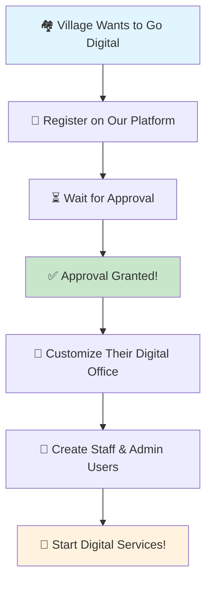
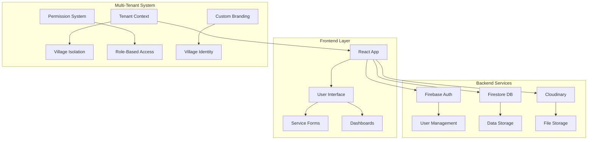
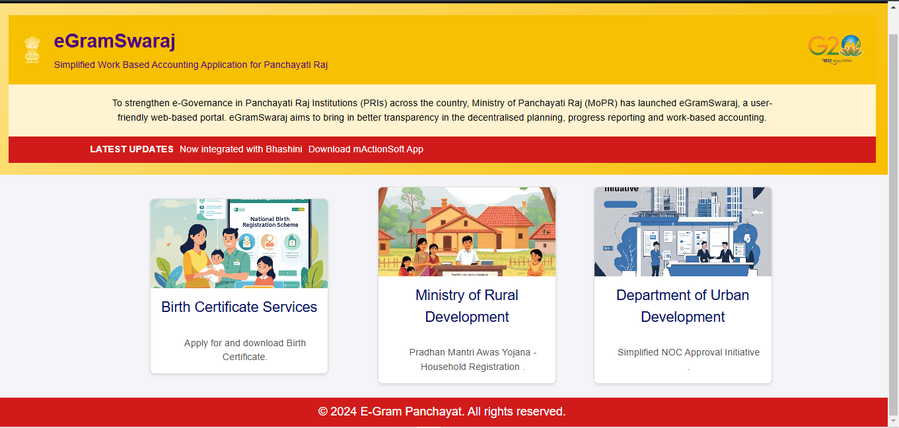
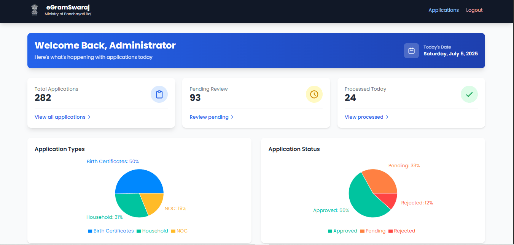
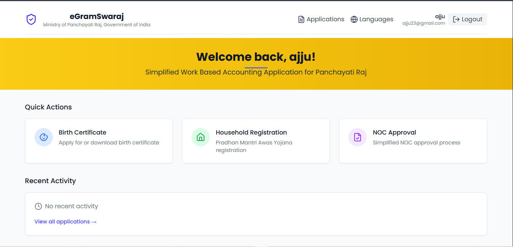

# 🏛️ E-Gram Panchayat - Digital Village Governance Platform

> **Empowering Rural India with Digital Services** 🌾✨

[](https://digitalindia.gov.in/)
[](https://reactjs.org/)
[](https://www.mongodb.com/)
[](LICENSE)

---

## 🎯 What is E-Gram Panchayat?

Imagine a **digital bridge** between villagers and their local government! 🏘️➡️🏛️

E-Gram Panchayat is like having a **mini-government office in your pocket** 📱. Instead of standing in long queues under the hot sun, villagers can now apply for certificates, track applications, and get government services from the comfort of their homes!

### 🌟 Why This Matters?
- **No More Waiting**: Apply for certificates anytime, anywhere! ⏰
- **Transparency**: See exactly where your application is stuck! 👀
- **Save Time**: No more traveling to government offices! 🚗💨
- **Digital India**: Making government services accessible to everyone! 🇮🇳

---

## 🏢 Multi-Tenant System - Our Superpower! 

Think of our platform like a **digital shopping mall** 🏪 where each village gets its own **customized store**! 

### 🔄 How It Works - The Village Registration Journey



### 🏛️ Who Can Join?

| 🏘️ **Village Type** | 📋 **What They Get** | 🎯 **Perfect For** |
|---------------------|----------------------|-------------------|
| **Gram Panchayat** 🏡 | Complete village management system | Small villages, rural areas |
| **Municipal Corporation** 🏙️ | City-level governance tools | Towns and cities |
| **Nagar Panchayat** 🏘️ | Semi-urban governance | Growing towns |
| **Block Development Office** 🏢 | Administrative oversight | Multiple villages |

### 🚀 After Approval - The Magic Begins!

1. **🎨 Custom Branding**: Each village gets their own logo, colors, and identity
2. **👥 User Management**: Create staff members, administrators, and citizens
3. **📱 Digital Services**: Start offering online services to villagers
4. **📊 Analytics**: Track how many people are using their services
5. **🔔 Notifications**: Keep everyone updated about their applications

---

## ✨ What Can Villagers Do?

### 🏠 **For Regular Citizens** 👨‍👩‍👧‍👦

| 🎯 **Service** | 📝 **What You Get** | ⏱️ **Time Saved** |
|----------------|---------------------|-------------------|
| **Birth Certificate** 👶 | Official birth record | 2-3 weeks → 2-3 days |
| **Household Certificate** 🏠 | Family composition proof | 1 month → 1 week |
| **NOC (No Objection)** ✅ | Permission documents | 3-4 weeks → 1 week |
| **Income Certificate** 💰 | Financial status proof | 2-3 weeks → 3-4 days |

### 👨‍💼 **For Village Staff** 🏛️

- **📋 Review Applications**: Check submitted documents
- **✅ Approve/Reject**: Make decisions with digital signatures
- **📱 Send Updates**: Keep citizens informed
- **📊 Generate Reports**: See how many people applied

### 👑 **For Village Administrators** 👑

- **👥 Manage Staff**: Add/remove team members
- **🎨 Customize Platform**: Make it look like their village
- **📈 View Statistics**: See platform usage
- **⚙️ Configure Services**: Choose what services to offer

---

## 🛠️ How Does It Work? (Simple Explanation!)

### 🔐 **Step 1: Village Registration** 📝
```
🏘️ Village Leader → 📱 Visits our website → 📝 Fills form → ⏳ Waits for approval
```

### ✅ **Step 2: Approval Process** 👀
```
👨‍💼 Our Team → 🔍 Reviews application → ✅ Approves → 🎉 Village goes live!
```

### 🎨 **Step 3: Customization** 🎨
```
🏛️ Village Admin → 🎨 Picks colors & logo → 👥 Adds staff → 🚀 Ready to serve!
```

### 📱 **Step 4: Citizens Use It** 👨‍👩‍👧‍👦
```
👨‍👩‍👧‍👦 Villager → 📱 Opens app → 📝 Applies for certificate → ⏳ Tracks progress → ✅ Gets document!
```

---

## 🚀 Getting Started - For Village Leaders

### 📋 **Prerequisites** ✅
- **💻 Computer or Smartphone** (any device works!)
- **🌐 Internet Connection** (even slow internet is fine!)
- **📧 Email Address** (to receive updates)
- **🏛️ Official Position** (village head, council member, etc.)

### 🎯 **Registration Steps** 📝

1. **🌐 Visit Our Website**
   - Go to [E-GramPanchayat.com](https://e-grampanchayat.onrender.com/)
   - Click "Register Your Village" button

2. **📝 Fill the Form**
   - Village name and location
   - Your contact information
   - Type of local body (Gram Panchayat, Municipal Corp, etc.)
   - Current population and services needed

3. **📤 Submit & Wait**
   - We'll review within 2-3 business days
   - You'll get email updates about your application

4. **🎉 Welcome to Digital Village!**
   - Set up your admin account
   - Customize your platform
   - Start adding staff members
   - Begin offering digital services!

---

## 🛠️ Technical Details (For Developers) 👨‍💻

### 🏗️ **Architecture Overview**



### 🎯 **Tech Stack**

| 🏷️ **Category** | 🛠️ **Technology** | 📖 **What It Does** |
|-----------------|-------------------|-------------------|
| **Frontend** 🎨 | React 18.3.1 | Makes the website interactive |
| **Styling** 🎭 | Tailwind CSS | Makes it look beautiful |
| **Database** 💾 | **MongoDB** | Stores Panchayat data, citizen records, applications, and services |
| **Authentication** 🔐 | **Node.js + Express + JWT** | Secure login & role-based access for citizens, staff, and admins |
| **File Storage** 📂 | **Cloudinary** | Uploads & manages certificates, documents, and images safely |
| **API Layer** 🌐 | **Express.js (Node.js)** | Connects frontend with backend & handles business logic |
| **HTTP Client** 🔌 | **Axios** | Smooth communication between frontend and backend Keeps accounts secure  |
| **File Storage** 📁 | **Cloudinary** | Stores documents safely |
| **Hosting** ☁️ | **Render** | Makes the app fast |

### 📁 **Project Structure**

```
e-grampanchayat/
├── 🏠 public/                    # Images and static files
├── 🎯 src/
│   ├── 🧩 components/            # Building blocks of the app
│   │   ├── 🏛️ admin/            # Admin dashboard components
│   │   ├── 🏘️ tenant/           # Multi-tenant system
│   │   ├── 👥 Dashboard.jsx     # Main dashboard
│   │   ├── 🚪 Login.jsx         # Login page
│   │   └── 📝 Register.jsx      # Registration page
│   ├── 🔧 services/              # Business logic
│   │   ├── 🏠 birth_cert.jsx    # Birth certificate service
│   │   ├── 🏘️ houseHold.jsx     # Household certificate
│   │   └── ✅ NocForm.jsx        # NOC service
│   ├── 🎨 styles/                # CSS styling
│   ├── 🔐 context/               # Data management
│   ├── 🚀 App.jsx                # Main app component
│ 
├── 📦 package.json               # Dependencies
├── ⚡ vite.config.js             # Build configuration
└── 🎨 tailwind.config.js         # Styling configuration
```

### 🔐 **Multi-Tenant Security**

- **🏘️ Data Isolation**: Each village's data is completely separate
- **👥 Role-Based Access**: Different permissions for different users
- **🔒 Secure Authentication**: Firebase handles all security
- **📱 Mobile Responsive**: Works on all devices

---

## 🚀 Installation & Setup

### 🎯 **For Village Leaders (Non-Technical)**

1. **📱 Visit our website**
2. **📝 Fill the registration form**
3. **⏳ Wait for approval**
4. **🎉 Start using your digital village!**

### 👨‍💻 **For Developers**

```bash
# 1. Get the code
git clone https://github.com/AsjadJDawre/e-grampanchayat.git
cd e-grampanchayat

# 2. Install tools
npm install

# 3. Set up environment
cp .env-sample .env
# Edit .env with your API keys

# 4. Start development
npm run dev

# 5. Build for production
npm run build
```

---

## 📱 **Screenshots & Demo**

| 🖼️ **Dashboard** | 🏛️ **Admin Panel** | 📱 **Mobile View** |
|------------------|-------------------|-------------------|
|  |  |  |

---

## 🌟 **Success Stories**

> *"Our village went from paper-based to digital in just 2 weeks! Now villagers can apply for certificates from home."* 
> - **Sarpanch, Gram Panchayat XYZ** 🏘️

> *"The multi-tenant system is amazing! Each village gets their own identity while sharing the same powerful platform."*
> - **Municipal Commissioner, City ABC** 🏙️

---

## 🔮 **What's Coming Next?**

- 🌍 **Multi-Language Support** (Hindi, English, Regional)
- 📱 **Mobile App** (iOS & Android)
- 🤖 **AI Document Verification**
- 🔐 **Digital Signature Integration**
- 📊 **Advanced Analytics Dashboard**
- 🌐 **Government Database Integration**

---

## 🤝 **Join the Digital Revolution!**

### 🏘️ **For Villages**
- **📧 Email**: [asjaddawre2@gmail.com]
- **📱 WhatsApp**: [Soon on  WhatsApp Number]
- **🌐 Website**: [Our-website.com](https://e-grampanchayat.onrender.com/)

### 👨‍💻 **For Developers**
- **🐛 Report Bugs**: [GitHub Issues](https://github.com/AsjadJDawre/e-grampanchayat/issues)
- **💡 Suggest Features**: [GitHub Discussions](https://github.com/AsjadJDawre/e-grampanchayat/discussions)
- **📚 Documentation**: [Project Wiki](https://github.com/AsjadJDawre/e-grampanchayat/wiki)

---

## 📄 **License**

This project is licensed under the **MIT License** - feel free to use it for your village! 🎉

---

<div align="center">

## 🎉 **Made with ❤️ for Digital India** 🇮🇳

### *Empowering Rural Communities Through Technology* 🌾✨

[](https://digitalindia.gov.in/)
[](https://github.com/AsjadJDawre/e-grampanchayat)

**🏛️ Transform Your Village Today! 🚀**

</div>
